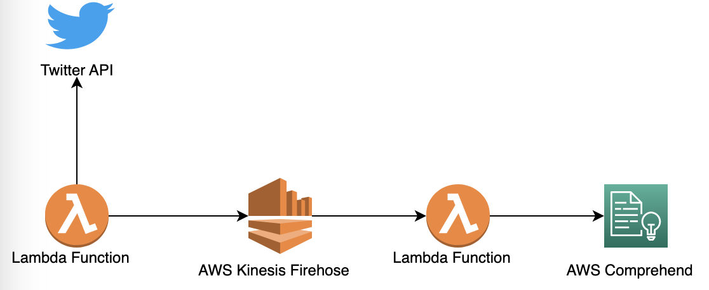

# comprehend_project

`In this repository you will find a serverless project to process real time data using AWS Comprehend`

## Explanation

AWS Comprehend is a Amazon Comprehend is a natural-language processing (NLP) service that uses machine learning to uncover valuable insight and connections in text.

AWS Comprehend is a natural-language processing (NLP) service that uses machine learning to uncover valuable insights and connections in text.
In this case AWS Comprehend is used to analyze the language of the text.

## Deployment
For the implementation of this project, use `terraform plan` and `terraform apply` commands in the terraform folder.

